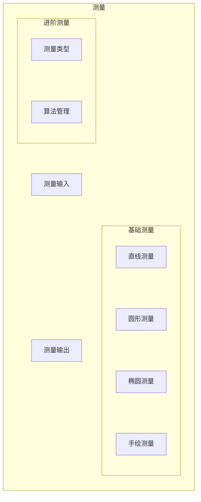

# 测绘测量

## 模块结构图


```mermaid
flowchart TB
    subgraph Measure[测量]
        direction TB
        
        subgraph Basic[基础测量]
            direction TB
            L1[直线测量]
            L2[圆形测量]
            L3[椭圆测量]
            L4[手绘测量]
            L1 ~~~ L2 ~~~ L3 ~~~ L4
        end

        subgraph Adv[进阶测量]
            direction TB
            A1[测量类型]
            A2[算法管理]
            A1 ~~~ A2
        end

        Input[测量输入]
        Output[测量输出]

        Adv ~~~ Input
        Input ~~~ Output
    end
```

## 流程概述


```mermaid
flowchart TD
    Start([开始]) --> Basic[测量]
    
    Basic --> Condition{进阶测量?}
    
    Condition -->|是| Type[进阶测量类型]
    Type --> first[进行基础测量]
    first --> Algo[进阶测量算法]
    Algo --> ExecAdv[执行进阶测量]
    
    Condition -->|否| FinishBasic[进行基础测量]
    
    ExecAdv --> Output([输出结果])
    FinishBasic --> Output
    
    Output --> Stop([结束])

    linkStyle default stroke:#FFFFFF,stroke-width:2px
```

## 目的

- 提供包含基础图形与进阶算法的标准化测量能力，确保进阶测量以基础测量为前提，实现高精度、可扩展的测绘流程与算法管理

## 模块统类

- 模块类

```cpp
class MeasureKits;
```
